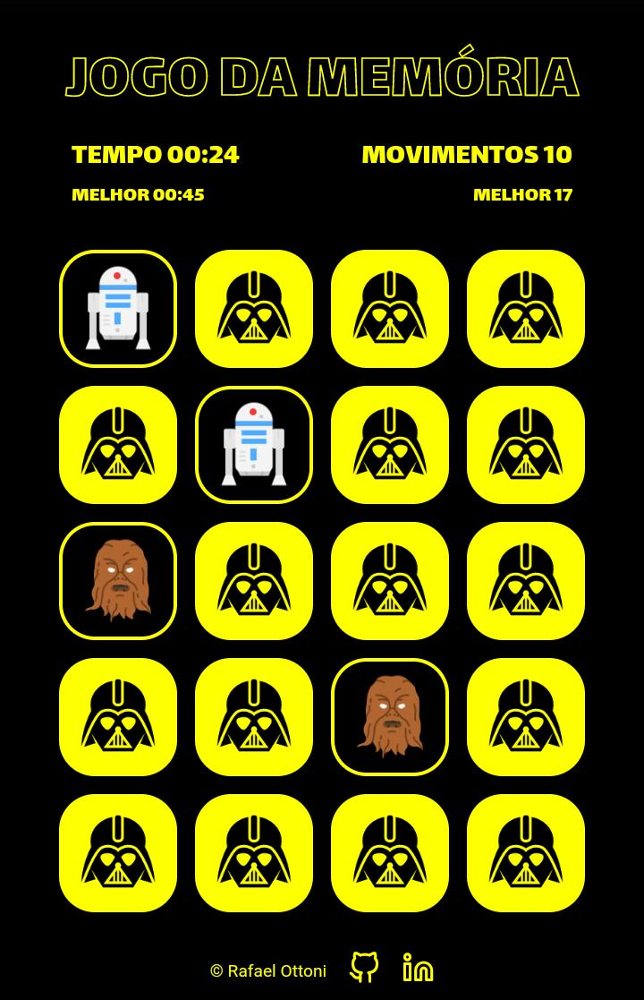

<h1 align="center">Jogo da Memória</h1>

      
    

## Sobre

Um site com jogo da memória, desenvolvido no curso de desenvolvimento web do Programadorbr. Site criado para estudo de HTML, CSS e JavaScript.

## Features

- [x] Modificar visual
- [x] Acrescentar contador de tempo e de movimentos
- [x] Armazenar melhores tempo e movimento no Local Storage

## Tecnologias

As seguintes ferramentas foram usadas na construção do projeto:

- [JavaScript](https://www.javascript.com/)
- HTML
- CSS
